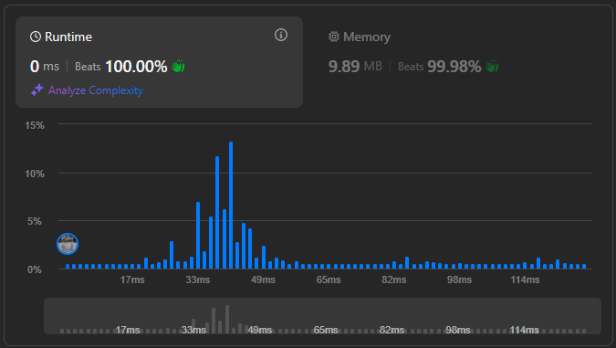

# leetcode C++高性能版

[leetcode](https://leetcode.com)的C++高性能题解，追求运行时长top 99%+

## 数据统计

 Top100受欢迎题目: 78 / 100 已解决

 Top面试题目: 86 / 145 已解决

 总计: 159 / 2573 已解决

 运行时长 **99%** 以上的题解占比: 108 / 159

## 题解

1. [Two Sum](https://leetcode.com/problems/two-sum/description/)

- Hash table (unorderd_map): [0ms](https://leetcode.com/problems/two-sum/submissions/1743444479/) **(top 100.00%)**

2. [Add Two Numbers](https://leetcode.com/problems/add-two-numbers/description/)

- Linked list: [0ms](https://leetcode.com/problems/add-two-numbers/submissions/1744458758/) **(top 100.00%)**

3. [Longest Substring Without Repeating Characters](https://leetcode.com/problems/longest-substring-without-repeating-characters/)

- Hash table (vector): [0ms](https://leetcode.com/submissions/detail/624009196/) **(top 100.00%)**

4. [Median of Two Sorted Arrays](https://leetcode.com/problems/median-of-two-sorted-arrays/)

- Non-recursive: [0ms](https://leetcode.com/problems/median-of-two-sorted-arrays/submissions/1744462906/) **(top 100.00%)**
- Recursion: [0ms](https://leetcode.com/problems/median-of-two-sorted-arrays/submissions/1744461258/) **(top 100.00%)**

5. [Longest Palindromic Substring](https://leetcode.com/problems/longest-palindromic-substring/)

- Brute force: [0ms](https://leetcode.com/problems/longest-palindromic-substring/submissions/1744465370/) **(top 100.00%)**
- Manacher's algorithm: [0ms](https://leetcode.com/submissions/detail/163268305/) **(top 100.00%)**

6. [ZigZag Conversion](https://leetcode.com/problems/zigzag-conversion/)

- Brute force: [31ms](https://leetcode.com/problems/zigzag-conversion/submissions/1744467555/) (top 11.68%)
- Fast for-loop: [0ms](https://leetcode.com/problems/zigzag-conversion/submissions/1744468546/) **(top 100.00%)**

7. [Reverse Integer](https://leetcode.com/problems/reverse-integer/)

- [0ms](https://leetcode.com/submissions/detail/625325000/) **(top 100.00%)**

8. [String to Integer (atoi)](https://leetcode.com/submissions/detail/163418517/)

- [0ms](https://leetcode.com/submissions/detail/625369303/) **(top 100.00%)**

9. [Palindrome Number](https://leetcode.com/problems/palindrome-number/)

- Lookup table: [0ms](https://leetcode.com/problems/palindrome-number/submissions/1744470289/) **(top 100.00%)**

10. [Regular Expression Matching](https://leetcode.com/problems/regular-expression-matching/)

- Dynamic programming: [0ms](https://leetcode.com/problems/regular-expression-matching/submissions/1744471585/) **(top 100.00%)**

11. [Container With Most Water](https://leetcode.com/problems/container-with-most-water/)

- Two pointers: [0ms](https://leetcode.com/problems/container-with-most-water/submissions/1744473200/) **(top 100.00%)**

12. [Integer to Roman](https://leetcode.com/problems/integer-to-roman/)

- Two arrays: [0ms](https://leetcode.com/problems/integer-to-roman/submissions/1744474752/) **(top 100.00%)**
- Lookup table: [0ms](https://leetcode.com/problems/integer-to-roman/submissions/1744475813/) **(top 100.00%)**

13. [Roman to Integer](https://leetcode.com/problems/roman-to-integer/)

- [0ms](https://leetcode.com/problems/roman-to-integer/submissions/1744478202/) **(top 100.00%)**
- Map: [3ms](https://leetcode.com/problems/roman-to-integer/submissions/1744481945/) (top 75.78%)

14.  [Longest Common Prefix](https://leetcode.com/problems/longest-common-prefix/)

- [0ms](https://leetcode.com/problems/longest-common-prefix/submissions/1744485165/) **(top 100.00%)**

15. [3Sum](https://leetcode.com/problems/3sum/)

- Two pointers: [31ms](https://leetcode.com/problems/3sum/submissions/1744487682/) **(top 99.17%)**

16. [3Sum Closest](https://leetcode.com/problems/3sum-closest/)

- Two pointers: [5ms](https://leetcode.com/problems/3sum-closest/submissions/1744497480/) (top 93.93%)

17. [Letter Combinations of a Phone Number](https://leetcode.com/problems/letter-combinations-of-a-phone-number/)

- Deque: [0ms](https://leetcode.com/problems/letter-combinations-of-a-phone-number/submissions/1744500143/) **(top 100.00%)**
- DFS: [0ms](https://leetcode.com/submissions/detail/625909390/) **(top 100.00%)**

18. [4Sum](https://leetcode.com/problems/4sum/)

- Set: [35ms](https://leetcode.com/problems/4sum/submissions/1744504101/) (top 16.53%)
- Fast for-loop: [0ms](https://leetcode.com/problems/4sum/submissions/1744501884/) **(top 100.00%)**

19. [Remove Nth Node From End of List](https://leetcode.com/problems/remove-nth-node-from-end-of-list/)

- [0ms](https://leetcode.com/submissions/detail/625919082/) **(top 100.00%)**

20. [Valid Parentheses](https://leetcode.com/problems/valid-parentheses/)

- Stack: [0ms](https://leetcode.com/problems/valid-parentheses/submissions/1744507576/) **(top 100.00%)**
- Lookup table: [0ms](https://leetcode.com/problems/valid-parentheses/submissions/1744508432/) **(top 100.00%)**

21. [Merge Two Sorted Lists](https://leetcode.com/problems/merge-two-sorted-lists/)

- Two swaps: [0ms](https://leetcode.com/problems/merge-two-sorted-lists/submissions/1744509502/) **(top 100.00%)**

22. [Generate Parentheses](https://leetcode.com/problems/generate-parentheses/)

- [0ms](https://leetcode.com/submissions/detail/626012181/) **(top 100.00%)**
- Deque: [0ms](https://leetcode.com/problems/generate-parentheses/submissions/1415504971) **(top 100.00%)**

23. [Merge k Sorted Lists](https://leetcode.com/problems/merge-k-sorted-lists/)

- Use 021: [0ms](https://leetcode.com/problems/merge-k-sorted-lists/submissions/1744511229/) **(top 100.00%)**
- Priority queue: [0ms](https://leetcode.com/problems/merge-k-sorted-lists/submissions/1744512697/) **(top 100.00%)**

24. [Swap Nodes in Pairs](https://leetcode.com/problems/swap-nodes-in-pairs/)

- [0ms](https://leetcode.com/submissions/detail/318720097/) **(top 100.00%)**

25. [Reverse Nodes in k-Group](https://leetcode.com/problems/reverse-nodes-in-k-group/)

- [0ms](https://leetcode.com/problems/reverse-nodes-in-k-group/submissions/1744513834/) **(top 100.00%)**

26. [Remove Duplicates from Sorted Array](https://leetcode.com/problems/remove-duplicates-from-sorted-array/)

- [0ms](https://leetcode.com/problems/remove-duplicates-from-sorted-array/submissions/1744515251/) **(top 100.00%)**

27. [Remove Element](https://leetcode.com/problems/remove-element/)

- [0ms](https://leetcode.com/submissions/detail/318922754/) **(top 100.00%)**

28. [Find the Index of the First Occurrence in a String](https://leetcode.com/problems/find-the-index-of-the-first-occurrence-in-a-string/)

- Brute force: [0ms](https://leetcode.com/problems/find-the-index-of-the-first-occurrence-in-a-string/submissions/1744518236/) **(top 100.00%)**
- KMP: [0ms](https://leetcode.com/problems/find-the-index-of-the-first-occurrence-in-a-string/submissions/1744523486/) **(top 100.00%)**

29. [Divide Two Integers](https://leetcode.com/problems/divide-two-integers/)

- [0ms](https://leetcode.com/problems/divide-two-integers/submissions/1744526748/) **(top 100.00%)**

30. [Substring with Concatenation of All Words](https://leetcode.com/problems/substring-with-concatenation-of-all-words/)

- [16ms](https://leetcode.com/problems/substring-with-concatenation-of-all-words/submissions/1744528957/) (top 90.48%)

31. [Next Permutation](https://leetcode.com/problems/next-permutation/)

- [0ms](https://leetcode.com/problems/next-permutation/submissions/1744532022/) **(top 100.00%)**

32. [Longest Valid Parentheses](https://leetcode.com/problems/longest-valid-parentheses/)

- [0ms](https://leetcode.com/problems/longest-valid-parentheses/submissions/1744537185/) **(top 100.00%)**

33. [Search in Rotated Sorted Array](https://leetcode.com/problems/search-in-rotated-sorted-array/)

- [0ms](https://leetcode.com/submissions/detail/229278082/) **(top 100.00%)**

34. [Find First and Last Position of Element in Sorted Array](https://leetcode.com/problems/find-first-and-last-position-of-element-in-sorted-array/)

- [0ms](https://leetcode.com/problems/find-first-and-last-position-of-element-in-sorted-array/submissions/1744538658/) **(top 100.00%)**

35. [Search Insert Position](https://leetcode.com/problems/search-insert-position/)

- [0ms](https://leetcode.com/problems/search-insert-position/submissions/1416053798) **(top 100.00%)**

36. [Valid Sudoku](https://leetcode.com/problems/valid-sudoku/)

- [3ms](https://leetcode.com/problems/valid-sudoku/submissions/1744540255/) (top 62.61%)

37. [Sudoku Solver](https://leetcode.com/problems/sudoku-solver/)

- [4ms](https://leetcode.com/submissions/detail/338275850/) (top 98.43%)

38. [Count and Say](https://leetcode.com/problems/count-and-say/)

- [0ms](https://leetcode.com/problems/count-and-say/submissions/1744550630/) **(top 100.00%)**

39. [Combination Sum](https://leetcode.com/problems/combination-sum/)

- [0ms](https://leetcode.com/problems/combination-sum/submissions/1744551584/) **(top 100.00%)**

40. [Combination Sum II](https://leetcode.com/problems/combination-sum-ii/)

- [0ms](https://leetcode.com/problems/combination-sum-ii/submissions/1744552804/) **(top 100.00%)**

41. [First Missing Positive](https://leetcode.com/problems/first-missing-positive/)

- [4ms](https://leetcode.com/submissions/detail/229675184/) (top 96.34%)

42. [Trapping Rain Water](https://leetcode.com/problems/trapping-rain-water/)

- [4ms](https://leetcode.com/submissions/detail/229679714/) **(top 99.71%)**

43. [Multiply Strings](https://leetcode.com/problems/multiply-strings/)

- C++ interface: [8ms](https://leetcode.com/submissions/detail/338314781/) (top 72.26%)
- C interface: [4ms](https://leetcode.com/submissions/detail/338320543/) (top 97.53%)

44. [Wildcard Matching](https://leetcode.com/problems/wildcard-matching/)

- [4ms](https://leetcode.com/submissions/detail/229689968/) **(top 99.84%)**

45. [Jump Game II](https://leetcode.com/problems/jump-game-ii/)

- [8ms](https://leetcode.com/submissions/detail/338330469/) (top 95.32%)

46. [Permutations](https://leetcode.com/problems/permutations/)

- Recursive: [20ms](https://leetcode.com/submissions/detail/229700657/) (top 22.83%)
- Better loop: [12ms](https://leetcode.com/submissions/detail/229703064/) (top 96.86%)
- Backtracking: [4ms](https://leetcode.com/submissions/detail/337776417/) (top 96.41%)

47. [Permutations II](https://leetcode.com/problems/permutations-ii/)

- [8ms](https://leetcode.com/submissions/detail/337786224/) (top 96.44%)

48. [Rotate Image](https://leetcode.com/problems/rotate-image/)

- Direct rotation: [4ms](https://leetcode.com/submissions/detail/229728814/) (top 98.21%)
- Flip & swap: [4ms](https://leetcode.com/submissions/detail/229729814/) (top 98.21%)

49. [Group Anagrams](https://leetcode.com/problems/group-anagrams/)

- [40ms](https://leetcode.com/submissions/detail/230186536/) (top 95.50%)

50. [Pow(x, n)](https://leetcode.com/problems/powx-n/)

- [4ms](https://leetcode.com/submissions/detail/230192088/) (top 96.07%)

51. [N-Queens](https://leetcode.com/problems/n-queens/)

- [4ms](https://leetcode.com/submissions/detail/342609229/) **(top 99.62%)**

53. [Maximum Subarray](https://leetcode.com/problems/maximum-subarray/)

- Divide and conquer: [8ms](https://leetcode.com/submissions/detail/230357741/) (top 96.32%)
- Kadane: [4ms](https://leetcode.com/submissions/detail/230359418/) **(top 99.88%)**
- DP: [0ms](https://leetcode.com/submissions/detail/323667238/) **(top 100.00%)**

54. [Spiral Matrix](https://leetcode.com/problems/spiral-matrix/)

- [0ms](https://leetcode.com/submissions/detail/230362738/) **(top 100.00%)**

55. [Jump Game](https://leetcode.com/problems/jump-game/)

- [28ms](https://leetcode.com/submissions/detail/630825210/) **(top 99.98%)**

56. [Merge Intervals](https://leetcode.com/problems/merge-intervals/)

- [8ms](https://leetcode.com/submissions/detail/303486504/) **(top 100.00%)**

60. [Permutation Sequence](https://leetcode.com/problems/permutation-sequence/)

- [0ms](https://leetcode.com/submissions/detail/337796856/) **(top 100.00%)**

61. [Rotate List](https://leetcode.com/problems/rotate-list/)

- [4ms](https://leetcode.com/submissions/detail/643290409/) (top 94.70%)

62. [Unique Paths](https://leetcode.com/problems/unique-paths/)

- [0ms](https://leetcode.com/submissions/detail/630836580/) **(top 100.00%)**

63. [Unique Paths II](https://leetcode.com/problems/unique-paths-ii/)

- [0ms](https://leetcode.com/submissions/detail/323676108/) **(top 100.00%)**

64. [Minimum Path Sum](https://leetcode.com/problems/minimum-path-sum/)

- [4ms](https://leetcode.com/submissions/detail/323679136/) **(top 99.39%)**

66. [Plus One](https://leetcode.com/problems/plus-one/)

- [0ms](https://leetcode.com/submissions/detail/231259041/) **(top 100.00%)**

69. [Sqrt(x)](https://leetcode.com/problems/sqrtx/)

- [0ms](https://leetcode.com/submissions/detail/231415498/) **(top 100.00%)**

70. [Climbing Stairs](https://leetcode.com/problems/climbing-stairs/)

- [0ms](https://leetcode.com/submissions/detail/630859356/) **(top 100.00%)**

73. [Set Matrix Zeroes](https://leetcode.com/problems/set-matrix-zeroes/)

- [44ms](https://leetcode.com/submissions/detail/231696419/) (top 98.55%)

74. [Search a 2D Matrix](https://leetcode.com/problems/search-a-2d-matrix/)

- [4ms](https://leetcode.com/submissions/detail/327576061/) **(top 99.56%)**

75. [Sort Colors](https://leetcode.com/problems/sort-colors/)

- [0ms](https://leetcode.com/submissions/detail/630908376/) **(top 100.00%)**
- three pointer: [0ms](https://leetcode.com/submissions/detail/231976573/) **(top 100.00%)**

76. [Minimum Window Substring](https://leetcode.com/problems/minimum-window-substring/)

- sliding window: [32ms](https://leetcode.com/submissions/detail/232627407/) (top 38.25%)
- optimized sliding window: [44ms](https://leetcode.com/submissions/detail/232631706/) (top 19.33%)
- hash: [4ms](https://leetcode.com/submissions/detail/232634035/) **(top 99.92%)**

78. [Subsets](https://leetcode.com/problems/subsets/)

- [8ms](https://leetcode.com/submissions/detail/233101865/) (top 90.16%)
- backtrack: [4ms](https://leetcode.com/submissions/detail/303500829/) (top 98.41%)
- bitwise: [0ms](https://leetcode.com/submissions/detail/630925819/) **(top 100.00%)**

79. [Word Search](https://leetcode.com/problems/word-search/)

- [92ms](https://leetcode.com/submissions/detail/233113744/) (top 98.72%)
- [72ms](https://leetcode.com/submissions/detail/233115782/) (top 98.84%)

80. [Remove Duplicates from Sorted Array II](https://leetcode.com/problems/remove-duplicates-from-sorted-array-ii/)

- [3ms](https://leetcode.com/submissions/detail/635412822/) (top 92.82%)

84. [Largest Rectangle in Histogram](https://leetcode.com/problems/largest-rectangle-in-histogram/)

- recursion: [32ms](https://leetcode.com/submissions/detail/233599788/) (top 14.84%)
- two vector: [4ms](https://leetcode.com/submissions/detail/233606081/) **(top 100.00%)**
- one vector: [122ms](https://leetcode.com/submissions/detail/630955175/) (top 75.97%)

86. [Partition List](https://leetcode.com/problems/partition-list/)

- [7ms](https://leetcode.com/submissions/detail/643299729/) (top 62.59%)

88. [Merge Sorted Array](https://leetcode.com/problems/merge-sorted-array/)

- additional space: [4ms](https://leetcode.com/submissions/detail/233801676/) (top 96.53%)
- 3 pointers: [0ms](https://leetcode.com/submissions/detail/233802294/) **(top 100.00%)**

91. [Decode Ways](https://leetcode.com/problems/decode-ways/)

- [0ms](https://leetcode.com/submissions/detail/630967074/) **(top 100.00%)**

92. [Reverse Linked List II](https://leetcode.com/problems/reverse-linked-list-ii/)

- [0ms](https://leetcode.com/submissions/detail/641332798/) **(top 100.00%)**

94. [Binary Tree Inorder Traversal](https://leetcode.com/problems/binary-tree-inorder-traversal/)

- Recursion - list: [4ms](https://leetcode.com/submissions/detail/234690013/) (top 87.58%)
- Recursion - vector: [4ms](https://leetcode.com/submissions/detail/632078983/) (top 43.93%)
- Stack: [0ms](https://leetcode.com/submissions/detail/234693349/) **(top 100.00%)**
- Stack: [0ms](https://leetcode.com/submissions/detail/632069693/) **(top 100.00%)**

96. [Unique Binary Search Trees](https://leetcode.com/problems/unique-binary-search-trees/)

- [0ms](https://leetcode.com/submissions/detail/645366588/) **(top 100.00%)**

98. [Validate Binary Search Tree](https://leetcode.com/problems/validate-binary-search-tree/)

- Two pointers: [4ms](https://leetcode.com/submissions/detail/235902664/) **(top 99.99%)**
- [12ms](https://leetcode.com/submissions/detail/632116694/) (top 74.23%)

101. [Symmetric Tree](https://leetcode.com/problems/symmetric-tree/)

- Recursive: [0ms](https://leetcode.com/submissions/detail/236511384/) **(top 100.00%)**
- Queue: [4ms](https://leetcode.com/submissions/detail/632127799/) (top 81.64%)

102. [Binary Tree Level Order Traversal](https://leetcode.com/problems/binary-tree-level-order-traversal/)

- [0ms](https://leetcode.com/problems/binary-tree-level-order-traversal/submissions/900368853/) **(top 100.00%)**

103. [Binary Tree Zigzag Level Order Traversal](https://leetcode.com/problems/binary-tree-zigzag-level-order-traversal/)

- [3ms](https://leetcode.com/problems/binary-tree-zigzag-level-order-traversal/submissions/900385027/) (top 73.66%)

104. [Maximum Depth of Binary Tree](https://leetcode.com/problems/maximum-depth-of-binary-tree/)

- [8ms](https://leetcode.com/submissions/detail/632156409/) (top 75.97%)

105. [Construct Binary Tree from Preorder and Inorder Traversal](https://leetcode.com/problems/construct-binary-tree-from-preorder-and-inorder-traversal/)

- [29ms](https://leetcode.com/problems/construct-binary-tree-from-preorder-and-inorder-traversal/submissions/902042713/) (top 52.40%)
- hash: [16ms](https://leetcode.com/submissions/detail/317142296/) (top 89.76%)
- Stack: [7ms](https://leetcode.com/problems/construct-binary-tree-from-preorder-and-inorder-traversal/submissions/900852024/) **(top 99.57%)**

106. [Construct Binary Tree from Inorder and Postorder Traversal](https://leetcode.com/problems/construct-binary-tree-from-inorder-and-postorder-traversal/)

- [23ms](https://leetcode.com/problems/construct-binary-tree-from-inorder-and-postorder-traversal/submissions/902040628/) (top 57.38%)

108. [Convert Sorted Array to Binary Search Tree](https://leetcode.com/problems/convert-sorted-array-to-binary-search-tree/)

- [4ms](https://leetcode.com/submissions/detail/632241166/) **(top 99.83%)**

111. [Minimum Depth of Binary Tree](https://leetcode.com/problems/minimum-depth-of-binary-tree/)

- [4ms](https://leetcode.com/submissions/detail/303209807/) **(top 99.83%)**

114. [Flatten Binary Tree to Linked List](https://leetcode.com/problems/flatten-binary-tree-to-linked-list/)

- [4ms](https://leetcode.com/submissions/detail/645307070/) (top 89.52%)

116. [Populating Next Right Pointers in Each Node](https://leetcode.com/problems/populating-next-right-pointers-in-each-node/)

- [11ms](https://leetcode.com/problems/populating-next-right-pointers-in-each-node/submissions/900876771/) **(top 99.39%)**

118. [Pascal's Triangle](https://leetcode.com/problems/pascals-triangle/)

- swap: [4ms](https://leetcode.com/submissions/detail/317454106/) (top 51.26%)
- resize: [0ms](https://leetcode.com/submissions/detail/317455216/) **(top 100.00%)**
- [0ms](https://leetcode.com/submissions/detail/632260948/) **(top 100.00%)**

120. [Triangle](https://leetcode.com/problems/triangle/)

- [0ms](https://leetcode.com/submissions/detail/323662920/) **(top 100.00%)**

121. [Best Time to Buy and Sell Stock](https://leetcode.com/problems/best-time-to-buy-and-sell-stock/)

- priority queue: [12ms](https://leetcode.com/submissions/detail/317459138/) (top 17.37%)
- [4ms](https://leetcode.com/submissions/detail/317461596/) (top 97.69%)
- [76ms](https://leetcode.com/submissions/detail/632270517/) **(top 99.79%)**

122. [Best Time to Buy and Sell Stock II](https://leetcode.com/problems/best-time-to-buy-and-sell-stock-ii/)

- [0ms](https://leetcode.com/submissions/detail/317478340/) **(top 100.00%)**

123. [Best Time to Buy and Sell Stock III](https://leetcode.com/problems/best-time-to-buy-and-sell-stock-iii/)

- [68ms](https://leetcode.com/problems/best-time-to-buy-and-sell-stock-iii/submissions/) **(top 99.95%)**

124. [Binary Tree Maximum Path Sum](https://leetcode.com/problems/binary-tree-maximum-path-sum/)

- [16ms](https://leetcode.com/submissions/detail/317484156/) **(top 99.85%)**

125. [Valid Palindrome](https://leetcode.com/problems/valid-palindrome/)

- [4ms](https://leetcode.com/submissions/detail/317490447/) **(top 99.16%)**

127. [Word Ladder](https://leetcode.com/problems/word-ladder/)

- [28ms](https://leetcode.com/submissions/detail/632915025/) **(top 99.56%)**
- Graph + BFS: [138ms](https://leetcode.com/submissions/detail/632851048/) (top 67.54%)
- Graph + BiDir BFS: [131ms](https://leetcode.com/submissions/detail/632860437/) (top 69.50%)
- BiDir BFS: [560ms](https://leetcode.com/submissions/detail/632905123/) (top 34.48%)

128. [Longest Consecutive Sequence](https://leetcode.com/problems/longest-consecutive-sequence/)

- hash: [113ms](https://leetcode.com/problems/longest-consecutive-sequence/submissions/900960540/) (top 83.63%)
- sort: [59ms](https://leetcode.com/problems/longest-consecutive-sequence/submissions/900959271/) **(top 99.67%)**
- dp: [132ms](https://leetcode.com/problems/longest-consecutive-sequence/submissions/900958551/) (top 78.98%)

130. [Surrounded Regions](https://leetcode.com/problems/surrounded-regions/)

- [4ms](https://leetcode.com/submissions/detail/632941565/) **(top 99.88%)**

131. [Palindrome Partitioning](https://leetcode.com/problems/palindrome-partitioning/)

- backtrack: [159ms](https://leetcode.com/submissions/detail/632960985/) (top 63.39%)
- backtrack + DP: [100ms](https://leetcode.com/problems/palindrome-partitioning/submissions/901013626/) (top 91.71%)

134. [Gas Station](https://leetcode.com/problems/gas-station/)

- [0ms](https://leetcode.com/submissions/detail/318700236/) **(top 100.00%)**

136. [Single Number](https://leetcode.com/problems/single-number/)

- [4ms](https://leetcode.com/submissions/detail/318707842/) **(top 99.88%)**

141. [Linked List Cycle](https://leetcode.com/problems/linked-list-cycle/)

- [3ms](https://leetcode.com/submissions/detail/645252348/) **(top 99.91%)**

142. [Linked List Cycle II](https://leetcode.com/problems/linked-list-cycle-ii/)

- [3ms](https://leetcode.com/submissions/detail/645263608/) **(top 99.53%)**

144. [Binary Tree Preorder Traversal](https://leetcode.com/problems/binary-tree-preorder-traversal/)

- Recursion: [4ms](https://leetcode.com/submissions/detail/632089390/) (top 43.36%)
- Stack: [0ms](https://leetcode.com/submissions/detail/632085399/) **(top 100.00%)**

145. [Binary Tree Postorder Traversal](https://leetcode.com/problems/binary-tree-postorder-traversal/)

- Recursion: [4ms](https://leetcode.com/submissions/detail/632099108/) (top 44.24%)
- Stack: [0ms](https://leetcode.com/submissions/detail/632096936/) **(top 100.00%)**

146. [LRU Cache](https://leetcode.com/problems/lru-cache/)

- [711ms](https://leetcode.com/submissions/detail/636862837/) (top 29.13%)
- custom linked list: [316ms](https://leetcode.com/submissions/detail/637201261/) **(top 99.94%)**

150. [Evaluate Reverse Polish Notation](https://leetcode.com/problems/evaluate-reverse-polish-notation/)

- [12ms](https://leetcode.com/submissions/detail/303228064/) (top 91.72%)

153. [Find Minimum in Rotated Sorted Array](https://leetcode.com/problems/find-minimum-in-rotated-sorted-array/)

- [0ms](https://leetcode.com/submissions/detail/327603478/) **(top 100.00%)**

160. [Intersection of Two Linked Lists](https://leetcode.com/problems/intersection-of-two-linked-lists/)

- [28ms](https://leetcode.com/submissions/detail/641300625/) **(top 99.98%)**

187. [Repeated DNA Sequences](https://leetcode.com/problems/repeated-dna-sequences/)

- 3-bit hash: [52ms](https://leetcode.com/submissions/detail/327702045/) (top 81.78%)
- 2-bit hash: [4ms](https://leetcode.com/submissions/detail/327705672/) **(top 99.71%)**

188. [Best Time to Buy and Sell Stock IV](https://leetcode.com/problems/best-time-to-buy-and-sell-stock-iv/)

- [8ms](https://leetcode.com/submissions/detail/645280699/) (top 76.49%)

198. [House Robber](https://leetcode.com/problems/house-robber/)

- [0ms](https://leetcode.com/submissions/detail/323703382/) **(top 100.00%)**

206. [Reverse Linked List](https://leetcode.com/problems/reverse-linked-list/)

- two pointers: [12ms](https://leetcode.com/submissions/detail/641316788/) (top 27.83%)
- faster two pointers: [7ms](https://leetcode.com/submissions/detail/641321662/) (top 74.53%)
- recursion: [0ms](https://leetcode.com/problems/reverse-linked-list/submissions/901975778/) **(top 100.00%)**

213. [House Robber II](https://leetcode.com/problems/house-robber-ii/)

- [0ms](https://leetcode.com/submissions/detail/323713347/) **(top 100.00%)**

215. [Kth Largest Element in an Array](https://leetcode.com/problems/kth-largest-element-in-an-array/)

- [4ms](https://leetcode.com/submissions/detail/327677238/) **(top 99.81%)**
- quick sort: [0ms](https://leetcode.com/problems/kth-largest-element-in-an-array/submissions/1464291297/) **(top 100.00%)**

221. [Maximal Square](https://leetcode.com/problems/maximal-square/)

- [8ms](https://leetcode.com/submissions/detail/323687156/) **(top 99.64%)**

226. [Invert Binary Tree](https://leetcode.com/problems/invert-binary-tree/)

- [0ms](https://leetcode.com/submissions/detail/645299894/) **(top 100.00%)**

230. [Kth Smallest Element in a BST](https://leetcode.com/problems/kth-smallest-element-in-a-bst/)

- [7ms](https://leetcode.com/problems/kth-smallest-element-in-a-bst/submissions/902082496/) **(top 99.74%)**

234. [Palindrome Linked List](https://leetcode.com/problems/palindrome-linked-list/)

- [276ms](https://leetcode.com/submissions/detail/641348178/) (top 60.58%)

235. [Lowest Common Ancestor of a Binary Search Tree](https://leetcode.com/problems/lowest-common-ancestor-of-a-binary-search-tree/)

- [24ms](https://leetcode.com/submissions/detail/637241828/) (top 97.70%)

236. [Lowest Common Ancestor of a Binary Tree](https://leetcode.com/problems/lowest-common-ancestor-of-a-binary-tree/)

- [7ms](https://leetcode.com/submissions/detail/637252584/) **(top 99.85%)**

239. [Sliding Window Maximum](https://leetcode.com/problems/sliding-window-maximum/)

- [168ms](https://leetcode.com/submissions/detail/636104845/) **(top 99.89%)**

240. [Search a 2D Matrix II](https://leetcode.com/problems/search-a-2d-matrix-ii/)

- [84ms](https://leetcode.com/submissions/detail/327597630/) (top 72.87%)

278. [First Bad Version](https://leetcode.com/problems/first-bad-version/)

- [0ms](https://leetcode.com/submissions/detail/324623560/) **(top 100.00%)**

279. [Perfect Squares](https://leetcode.com/problems/perfect-squares/)

- [0ms](https://leetcode.com/submissions/detail/324570540/) **(top 100.00%)**
- Tree search: [92ms](https://leetcode.com/submissions/detail/324575850/) (top 79.03%)

283. [Move Zeroes](https://leetcode.com/problems/move-zeroes/)

- two pointers: [33ms](https://leetcode.com/submissions/detail/643338705/) (top 50.97%)
- faster two pointers: [16ms](https://leetcode.com/submissions/detail/643344367/) (top 97.08%)

287. [Find the Duplicate Number](https://leetcode.com/problems/find-the-duplicate-number/)

- Binary search: [8ms](https://leetcode.com/submissions/detail/327684807/) (top 94.55%)
- Two pointers: [4ms](https://leetcode.com/submissions/detail/327690200/) **(top 99.76%)**

300. [Longest Increasing Subsequence](https://leetcode.com/problems/longest-increasing-subsequence/)

- [0ms](https://leetcode.com/submissions/detail/323698359/) **(top 100.00%)**

301. [Remove Invalid Parentheses](https://leetcode.com/problems/remove-invalid-parentheses/)

- [12ms](https://leetcode.com/submissions/detail/324615389/) (top 68.31%)

309. [Best Time to Buy and Sell Stock with Cooldown](https://leetcode.com/problems/best-time-to-buy-and-sell-stock-with-cooldown/)

- [0ms](https://leetcode.com/submissions/detail/645290063/) **(top 100.00%)**

322. [Coin Change](https://leetcode.com/problems/coin-change/)

- [64ms](https://leetcode.com/submissions/detail/643922874/) (top 86.51%)

337. [House Robber III](https://leetcode.com/problems/house-robber-iii/)

- [44ms](https://leetcode.com/submissions/detail/645294530/) (top 13.37%)

349. [Intersection of Two Arrays](https://leetcode.com/problems/intersection-of-two-arrays/)

- Set: [4ms](https://leetcode.com/submissions/detail/328020887/) **(top 99.21%)**
- Map: [4ms](https://leetcode.com/submissions/detail/328024354/) **(top 99.21%)**

350. [Intersection of Two Arrays II](https://leetcode.com/problems/intersection-of-two-arrays-ii/)

- [4ms](https://leetcode.com/submissions/detail/328027553/) **(top 99.54%)**

438. [Find All Anagrams in a String](https://leetcode.com/problems/find-all-anagrams-in-a-string/)

- [27ms](https://leetcode.com/submissions/detail/644004382/) (top 41.24%)

450. [Delete Node in a BST](https://leetcode.com/problems/delete-node-in-a-bst/)

- [40ms](https://leetcode.com/submissions/detail/645361844/) (top 65.32%)

460. [LFU Cache](https://leetcode.com/problems/lfu-cache/)

- [853ms](https://leetcode.com/submissions/detail/637217647/) (top 36.82%)

509. [Fibonacci Number](https://leetcode.com/problems/fibonacci-number/)

- [0ms](https://leetcode.com/submissions/detail/643918215/) **(top 100.00%)**

538. [Convert BST to Greater Tree](https://leetcode.com/problems/convert-bst-to-greater-tree/)

- [20ms](https://leetcode.com/submissions/detail/645346521/) **(top 100.00%)**

540. [Single Element in a Sorted Array](https://leetcode.com/problems/single-element-in-a-sorted-array/)

- recursion: [19ms](https://leetcode.com/submissions/detail/633039574/) (top 96.25%)
- iteration: [12ms](https://leetcode.com/submissions/detail/633040407/) **(top 99.87%)**

543. [Diameter of Binary Tree](https://leetcode.com/problems/diameter-of-binary-tree/)

- [7ms](https://leetcode.com/submissions/detail/643913046/) (top 89.75%)

564. [Find the Closest Palindrome](https://leetcode.com/problems/find-the-closest-palindrome/)

- [0ms](https://leetcode.com/submissions/detail/633536384/) **(top 100.00%)**

567. [Permutation in String](https://leetcode.com/problems/permutation-in-string/)

- [11ms](https://leetcode.com/submissions/detail/644000752/) (top 56.65%)

652. [Find Duplicate Subtrees](https://leetcode.com/problems/find-duplicate-subtrees/)

- [28ms](https://leetcode.com/submissions/detail/645333592/) (top 96.32%)

654. [Maximum Binary Tree](https://leetcode.com/problems/maximum-binary-tree/)

- [64ms](https://leetcode.com/submissions/detail/645313434/) (top 98.82%)

670. [Maximum Swap](https://leetcode.com/problems/maximum-swap/)

- [0ms](https://leetcode.com/submissions/detail/643329094/) **(top 100.00%)**

700. [Search in a Binary Search Tree](https://leetcode.com/problems/search-in-a-binary-search-tree/)

- [32ms](https://leetcode.com/submissions/detail/645351013/) (top 98.21%)

701. [Insert into a Binary Search Tree](https://leetcode.com/problems/insert-into-a-binary-search-tree/)

- [72ms](https://leetcode.com/submissions/detail/645355583/) **(top 99.48%)**

704. [Binary Search](https://leetcode.com/problems/binary-search/)

- [20ms](https://leetcode.com/submissions/detail/645278035/) **(top 99.82%)**

714. [Best Time to Buy and Sell Stock with Transaction Fee](https://leetcode.com/problems/best-time-to-buy-and-sell-stock-with-transaction-fee/)

- [60ms](https://leetcode.com/submissions/detail/645283352/) **(top 99.69%)**

752. [Open the Lock](https://leetcode.com/problems/open-the-lock/)

- BFS: [180ms](https://leetcode.com/submissions/detail/643984062/) (top 81.07%)

832. [Flipping an Image](https://leetcode.com/problems/flipping-an-image/)

- [4ms](https://leetcode.com/submissions/detail/637229430/) (top 88.29%)

864. [Shortest Path to Get All Keys](https://leetcode.com/problems/shortest-path-to-get-all-keys/)

- [24ms](https://leetcode.com/submissions/detail/633564194/) (top 96.91%)

871. [Minimum Number of Refueling Stops](https://leetcode.com/problems/minimum-number-of-refueling-stops/)

- [179ms](https://leetcode.com/submissions/detail/645239204/) (top 16.32%)

876. [Middle of the Linked List](https://leetcode.com/problems/middle-of-the-linked-list/)

- [0ms](https://leetcode.com/submissions/detail/641286453/) **(top 100.00%)**

889. [Construct Binary Tree from Preorder and Postorder Traversal](https://leetcode.com/problems/construct-binary-tree-from-preorder-and-postorder-traversal/)

- [8ms](https://leetcode.com/problems/construct-binary-tree-from-preorder-and-postorder-traversal/submissions/902048921/) (top 89.88%)

958. [Check Completeness of a Binary Tree](https://leetcode.com/problems/check-completeness-of-a-binary-tree/)

- [3ms](https://leetcode.com/problems/check-completeness-of-a-binary-tree/submissions/915368515/) (top 84.99%)

1038. [Binary Search Tree to Greater Sum Tree](https://leetcode.com/problems/binary-search-tree-to-greater-sum-tree/)

- [0ms](https://leetcode.com/submissions/detail/645347712/) **(top 100.00%)**

1838. [Frequency of the Most Frequent Element](https://leetcode.com/problems/frequency-of-the-most-frequent-element/)

- [136ms](https://leetcode.com/submissions/detail/636124130/) **(top 99.88%)**

------

## 题目分类

| 分类 | 题目编号 |
| --- | --- |
| Array / String | 1, 3, 6, 11, 14, 15, 16, 18, 20, 22, 26, 27, 28, 30, 31, 38, 41, 42, 44, 45, 48, 49, 54, 55, 56, 73, 75, 76, 80, 88, 125, 239, 283, 349, 350, 438, 567, 670, 832, 1838 |
| Linked list | 2, 19, 21, 23, 24, 25, 61, 86, 92, 141, 142, 160, 206, 234, 876 |
| Recursion | 4, 33, 34, 35, 69, 74, 153, 215, 240, 278, 287, 301, 540, 704 |
| Dynamic Programming | 5, 10, 32, 36, 37, 53, 62, 63, 64, 70, 79, 84, 91, 96, 118, 120, 121, 122, 123, 128, 130, 134, 188, 198, 213, 221, 279, 300, 309, 322, 509, 714, 864, 871 |
| Numerical | 7, 8, 9, 12, 13, 29, 43, 50, 66, 136, 150, 564 |
| Backtracking | 17, 39, 40, 46, 47, 51, 60, 78, 131 |
| Binary Tree | 94, 98, 101, 102, 103, 104, 105, 106, 108, 111, 114, 116, 124, 144, 145, 226, 230, 235, 236, 337, 450, 538, 543, 652, 654, 700, 701, 889, 958, 1038 |
| Graph / DFS | 127, 752 |
| System Design | 146, 460 |

------

## 开发环境

已经在以下环境测试通过：

- macOS Sequoia 15.6
  - Clang 17.0.0
  - CMake 4.1.0
  - Catch2 v3.9.1
